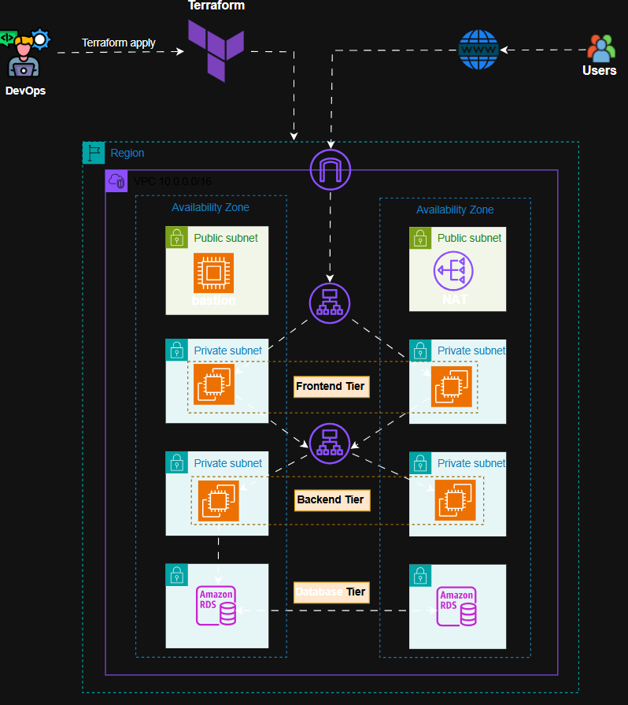
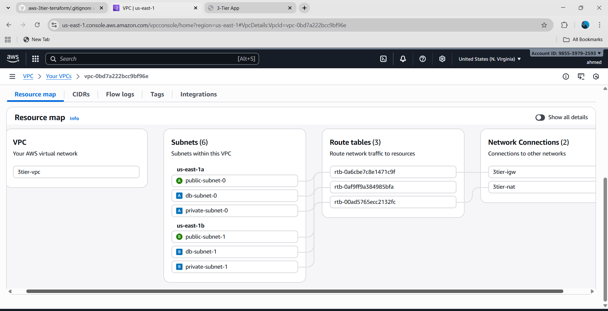
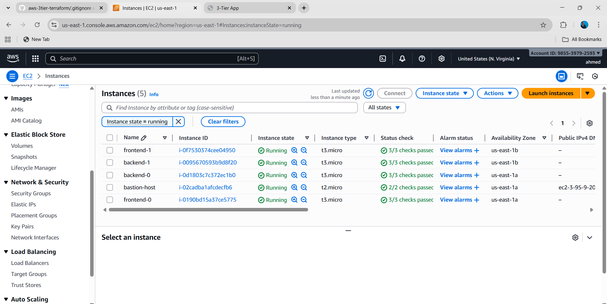
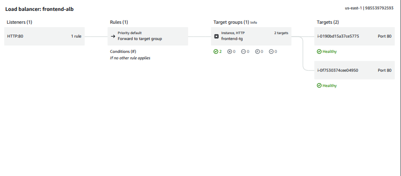
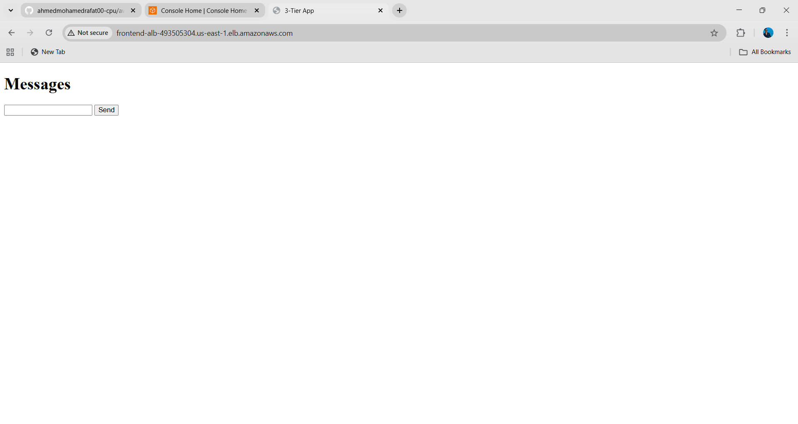
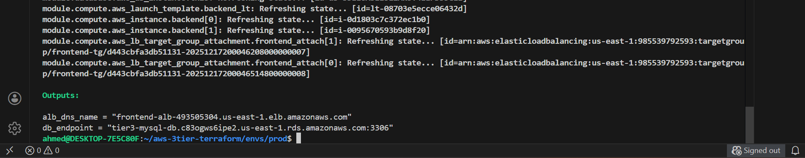

# 🚀 3-Tier Messages App on AWS using Terraform

This project demonstrates a **production-grade 3-tier web application** deployed on AWS using **Terraform (IaC)**.

Users submit messages from a frontend web page, which are processed by a backend Flask API and stored in a **MySQL RDS** database.

The infrastructure is **highly available**, **secure**, and **fully automated**.

---

## 🏗️ Architecture Diagram

---

## 🌐 Networking Layer

- Custom VPC (Multi-AZ)
- Public Subnets (ALB & Bastion)
- Private Subnets (Application EC2)
- Database Subnets (RDS)
- Internet Gateway
- NAT Gateway
- Route Tables & Associations

### VPC Overview

---

## 🖥️ Compute Layer

- EC2 instances deployed in **private subnets**
- Launch Templates
- Security Groups with least privilege
- Bastion Host for secure SSH access

### EC2 Instances

---

## ⚖️ Load Balancer

- Application Load Balancer (ALB)
- Public HTTP access on port 80
- Routes traffic to frontend EC2 instances
- Health checks enabled

### Frontend ALB

---

## 🧠 Application Architecture

### Frontend
- HTML + JavaScript
- Sends messages using REST API
- Displays messages dynamically
- Hosted on EC2 behind ALB

### Backend
- Flask application
- REST APIs:
  - `POST /api/add`
  - `GET /api/all`
  - `GET /health`
- Connects securely to RDS MySQL
- CORS enabled

### Frontend Application Page

---

## 🗄️ Database Layer

- Amazon RDS MySQL
- Multi-AZ enabled
- Private subnets only
- Access restricted to backend EC2 security group

---

## 📤 Terraform Outputs

Terraform provides important outputs after deployment:

- ALB DNS Name
- RDS Endpoint

---

## 🔐 Security Design

- ALB SG → Allows HTTP from internet
- Frontend SG → Allows traffic only from ALB
- Backend SG → Allows API access only from frontend
- DB SG → Allows MySQL only from backend
- Bastion SG → Allows SSH from admin IP only

---

## 🛠️ Tools & Technologies

- Terraform (HCL)
- AWS (EC2, VPC, ALB, RDS, IAM)
- Flask (Python)
- MySQL
- Linux (Amazon Linux / Ubuntu)
- Git & GitHub

---

## ⭐ Key Highlights

- Fully automated Infrastructure as Code
- Multi-AZ & Highly Available
- Secure network segmentation
- Real-world DevOps architecture
- Recruiter & production ready

---
📤 Terraform Outputs

After a successful deployment, Terraform outputs:

alb_dns_name → Public URL to access the frontend

db_endpoint → RDS MySQL endpoint

#########################################################

🧹 Cleanup

To remove all AWS resources and avoid unnecessary charges:

terraform destroy

#########################################################

⭐ Key Features

Multi-AZ high availability

Secure private subnets

Auto Scaling EC2 instances

Application Load Balancers

NAT Gateways for outbound access

RDS MySQL with Multi-AZ failover

Bastion host for secure SSH access

Fully Infrastructure-as-Code (IaC)

Uses official Terraform Registry modules

#########################################################

👤 Author

Ahmed Mohamed
Cloud / DevOps Engineer
AWS • Terraform • Linux • CI/CD • Networking 

